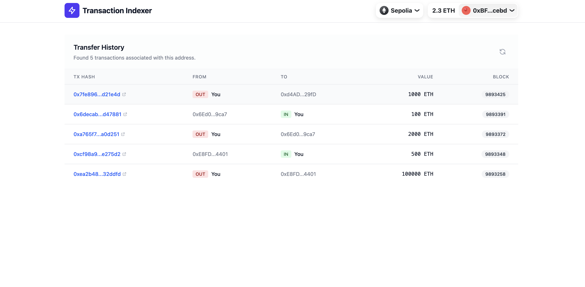

# Transaction Indexer

This project works as a transaction indexer for a specific ERC20 token (HookERC20) on the Sepolia testnet.
It consists of a backend service that indexes `Transfer` events into a local SQLite database and a frontend application that allows users to view their transaction history.

## API test

```sh
➜  Homework git:(main) curl -s http://localhost:3000/transfers/0xBF2A4454226E8296825d3eC06d08D6c0b41dcebd | jq
[
  {
    "id": 5,
    "hash": "0x7fe896bb8fd73c2a90a4200e3c321181d91ef06d41083dbc377cd5ba57d21e4d",
    "from_address": "0xBF2A4454226E8296825d3eC06d08D6c0b41dcebd",
    "to_address": "0xd4ADe8031E01492bE106335C7B5Eed81cd7A29fD",
    "value": "1000000000000000000000",
    "block_number": 9893425
  },
  {
    "id": 4,
    "hash": "0x6decab0837484434bcd3ce448fec9454616deb137b9ebdb3c61fb00213d47881",
    "from_address": "0x6Ed03ad0172F1Ecc9392426373C63a1114839ca7",
    "to_address": "0xBF2A4454226E8296825d3eC06d08D6c0b41dcebd",
    "value": "100000000000000000000",
    "block_number": 9893391
  },
  {
    "id": 3,
    "hash": "0xa765f7621cc22d30418253b877675138bef4b38102b9980d45ba18d573a0d251",
    "from_address": "0xBF2A4454226E8296825d3eC06d08D6c0b41dcebd",
    "to_address": "0x6Ed03ad0172F1Ecc9392426373C63a1114839ca7",
    "value": "2000000000000000000000",
    "block_number": 9893372
  },
  {
    "id": 2,
    "hash": "0xcf98a9f6bb9a7571b49be717ffcc1697d21cf3bf4b771450d10cf3a71ee275d2",
    "from_address": "0xE8FDE9408C65C743ff38bA0EbA5C85020F7B4401",
    "to_address": "0xBF2A4454226E8296825d3eC06d08D6c0b41dcebd",
    "value": "500000000000000000000",
    "block_number": 9893348
  },
  {
    "id": 1,
    "hash": "0xea2b489d8b83f6c72864996a8a83ac7e352aae31eaff856f54ec92cb4032ddfd",
    "from_address": "0xBF2A4454226E8296825d3eC06d08D6c0b41dcebd",
    "to_address": "0xE8FDE9408C65C743ff38bA0EbA5C85020F7B4401",
    "value": "100000000000000000000000",
    "block_number": 9893258
  }
]
➜  Homework git:(main) 
```

## Web UI



## Contract Details
- **Token Name**: HookERC20
- **Network**: Sepolia Testnet
- **Address**: `0xb8119Af65964BF83b0c44E8DD07e4bEbD3432d5c`

## Tech Stack

### Backend
- **Framework**: Express.js
- **Blockchain Interaction**: Viem
- **Database**: Better-SQLite3
- **Language**: TypeScript

### Frontend
- **Framework**: React (Vite)
- **Styling**: Tailwind CSS
- **Web3**: Wagmi, RainbowKit, Viem
- **Language**: TypeScript

## Getting Started

### Prerequisites
- Node.js (v18+)
- pnpm (recommended) or npm

### 1. Start the Backend
The backend indexes events and provides an API.

```bash
cd Backend
npm install
npm run dev
```
*The server will start at `http://localhost:3000` and begin indexing the last 10,000 blocks.*

### 2. Start the Frontend
The frontend displays the data.

```bash
cd Frontend
pnpm install
pnpm run dev
```
*The app will be available at `http://localhost:5173`.*

## Features
- **Automatic Indexing**: Continuously monitors the blockchain for new `Transfer` events.
- **Data Persistence**: Stores transaction data in a local SQLite file (`transfers.db`).
- **User Dashboard**: Connect wallet to view personal transaction history (Incoming & Outgoing).
- ** responsive UI**: Clean, modern interface built with Tailwind CSS.

## API Endpoints
- `GET /transfers/:address`: Returns a list of transfers where the address is either the sender or receiver.
