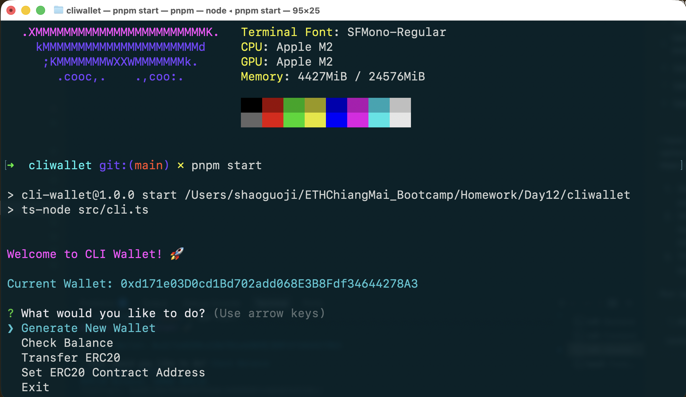
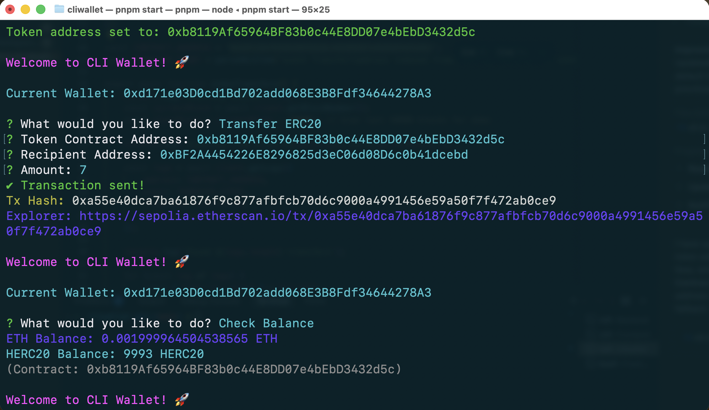

# CLI Wallet

A command-line interface wallet for the Sepolia Testnet, built with TypeScript and Viem.






## Features
- 🔑 **Key Generation**: Generate random private keys securely.
- 💰 **Balance Check**: Query Native ETH balance on Sepolia.
- 💸 **ERC20 Transfers**: Send tokens using EIP-1559 transactions.
- 🖥️ **Interactive Mode**: User-friendly menu for easy navigation.

## Prerequisites
- Node.js (v18 or higher)
- npm or pnpm

## Installation

1. Navigate to the project directory:
   ```bash
   cd Day12/CLIWallet
   ```

2. Install dependencies:
   ```bash
   npm install
   ```

## Configuration

The wallet uses a `.env` file to store your credentials. This file is automatically created when you generate a new wallet, or you can create it manually:

```bash
PRIVATE_KEY=0x...
RPC_URL=https://ethereum-sepolia-rpc.publicnode.com
```

## Usage

### 1. Interactive Mode (Recommended)
Simply run the start command to enter the interactive menu:
```bash
npm start
```
Follow the on-screen prompts to generate a wallet, check balances, or transfer tokens.

### 2. Command Line Arguments
You can also use the tool directly with arguments for automation.

**Generate New Wallet:**
```bash
npm start -- generate
```

**Check Balance:**
```bash
# Check loaded wallet's balance
npm start -- balance

# Check a specific address
npm start -- balance 0xYourAddress...
```

**Transfer ERC20 Tokens:**
```bash
npm start -- transfer \
  --token <TOKEN_ADDRESS> \
  --to <RECIPIENT_ADDRESS> \
  --amount <AMOUNT>
```

**Example USDC Transfer:**
```bash
npm start -- transfer \
  --token 0x1c7D4B196Cb0C7B01d743Fbc6116a902379C7238 \
  --to 0xRecipientAddress... \
  --amount 10
```

## Build
To compile the TypeScript code to JavaScript (optional, for distribution):
```bash
npm run build
```
The output will be in the `dist` folder.
