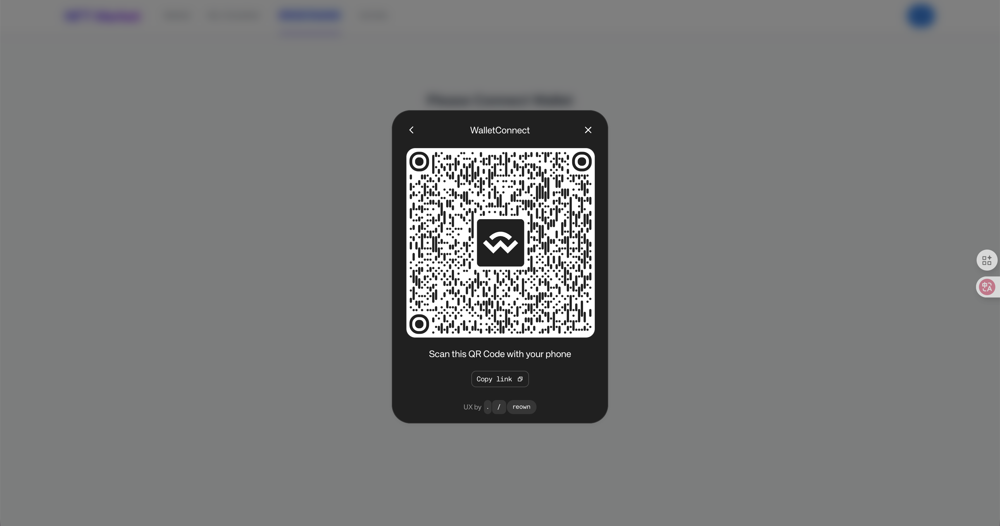
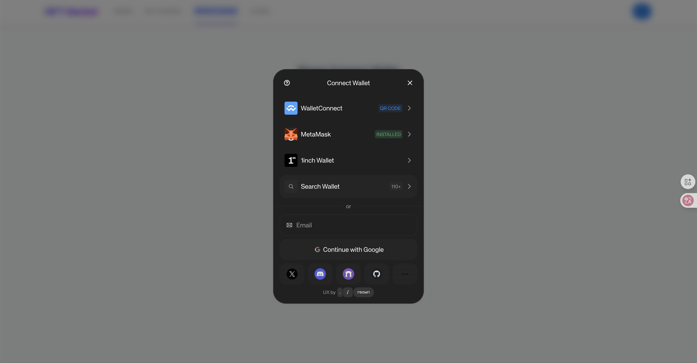
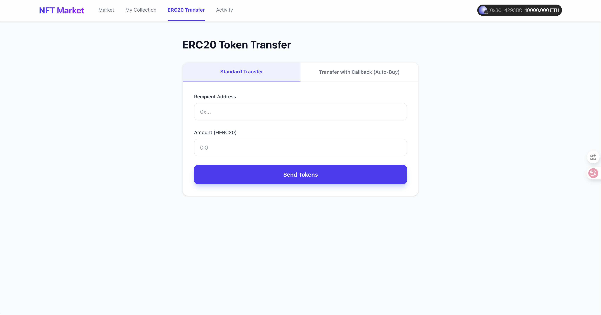
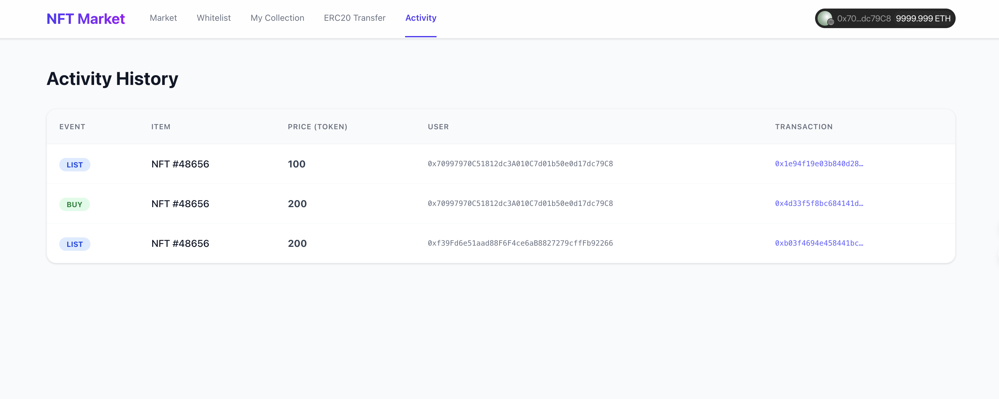

# NFT Market & ERC20 System

An NFT Marketplace built with Solidity and React, featuring an ERC20 token economy, NFT trading, and advanced transfer mechanisms like `transferWithCallback` for single-transaction purchasing.

## 📸 Screenshots

### Wallet Connect


### AppKit Integration


### Market


### My Collection


### ERC20 Transfer & Auto-Buy


### Activity History


---

## 🚀 Features

- **ERC721 NFT Support**: Mint, list, and transfer standard NFTs.
- **ERC20 Token Economy**: Use custom ERC20 tokens for all marketplace transactions.
- **Marketplace Logic**:
  - List NFTs for sale (approves Market contract).
  - Buy NFTs using ERC20 tokens.
  - **Auto-Buy**: Support for `transferWithCallback` to buy an NFT by simply transferring tokens to the market contract with the Token ID encoded.
- **Reactive Frontend**:
  - Real-time updates using event listeners.
  - Auto-refreshing UI for smooth user experience.
  - Wallet connection via Reown AppKit.

## 🛠 Tech Stack

- **Smart Contracts**: Solidity, Foundry, OpenZeppelin.
- **Frontend**: React, Vite, Tailwind CSS, Wagmi, Viem, Reown AppKit.
- **Tools**: Anvil (Local Blockchain), Make.

## 📦 Deployment & Setup

### prerequisites
- Node.js & pnpm
- Foundry (Forge, Anvil)

### 1. Start Local Blockchain
Start a local Anvil node to deploy contracts to.
```bash
anvil
```

### 2. Deploy Contracts
In a new terminal, deploy the smart contracts (NFTMarket, HookERC20, BaseERC721).
```bash
cd Contract
make deploy local
```
*This will deploy the contracts and automatically update `Frontend/src/config/contracts.ts` with the new addresses.*

### 3. Run Frontend
Start the React application.
```bash
cd Frontend
pnpm install
pnpm dev
```
Open [http://localhost:5173](http://localhost:5173) in your browser.

## 🎮 Usage Guide

1.  **Connect Wallet**: Login with your wallet (e.g., MetaMask connected to Anvil).
2.  **Mint NFT**: Go to "My Collection" and mint a new NFT.
3.  **List NFT**: Click "Approve Market" then "List for Sale" on your NFT card.
4.  **Buy NFT**:
    - **Standard Buy**: Go to "Market", switch accounts, approve tokens, and buy.
    - **Auto-Buy (Transfer w/ Callback)**: Go to "ERC20 Transfer", select "Transfer w/ Callback", enter the Token ID, and send. The NFT will be bought and transferred instantly.
