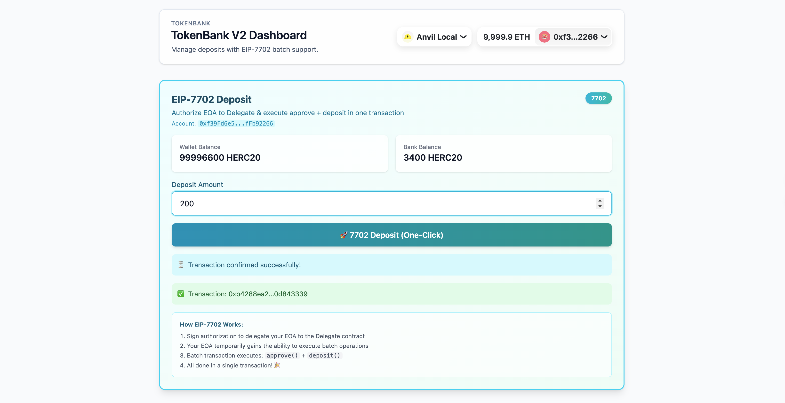

# TokenBank with EIP-7702 Support

A decentralized banking application implementing **EIP-7702** to enable seamless, one-click deposits via authorized account delegation.



## 🌟 Features

### 🚀 EIP-7702 One-Click Deposit (Batch Execution)
Traditional ERC20 deposits require two transactions: `approve()` followed by `deposit()`.
Using **EIP-7702**, this project authorizes a temporary delegation to a smart contract, allowing your Externally Owned Account (EOA) to execute a **batch of calls** in a single transaction.

- **Single Transaction**: Authorize code code + `approve` + `deposit` all happen in one go.
- **Batching**: Calls are batched and executed atomically.
- **Delegation**: Your EOA temporarily adopts the code of a `Delegate` contract.

### 🏦 Standard Banking Features
- **Deposit**: Standard ERC20 deposit flow.
- **Withdraw**: Retrieve your tokens from the bank.
- **Transfer with Callback**: Support for `transferAndCall` ("HookERC20") for direct contract interaction.

## 🛠️ Tech Stack

- **Smart Contracts**: Solidity, Foundry
- **Frontend**: React, TypeScript, Wagmi, Viem
- **Chain**: Anvil (Local Node) running `prague` hardfork

## 🏁 Getting Started

### Prerequisites
- [Foundry](https://book.getfoundry.sh/getting-started/installation)
- [Node.js](https://nodejs.org/) & [pnpm](https://pnpm.io/)

### 1. Start Local Blockchain
Start Anvil with the **Prague hardfork** to enable EIP-7702 support:

```bash
anvil --hardfork prague
```

### 2. Deploy Contracts
In a new terminal, deploy the contracts to your local node:

```bash
cd Contract
make deploy local
```
*Note: This script deploys `HookERC20`, `TokenBankV2`, and `Delegate` contracts.*

### 3. Configure Frontend
Navigate to the frontend directory:

```bash
cd ../Frontend
```

Create a `.env` file and configure your testing private key (required for local EIP-7702 signing):

```bash
echo "VITE_PRIVATE_KEY=0xac0974bec39a17e36ba4a6b4d238ff944bacb478cbed5efcae784d7bf4f2ff80" > .env
```
*Note: The key above is the default Anvil account #0, which holds the deployed tokens.*

### 4. Run Application

```bash
pnpm install
pnpm dev
```

Open [http://localhost:5173](http://localhost:5173) in your browser.

## 📖 How EIP-7702 Execution Works

1. **Authorization**: The user signs an EIP-7702 authorization message. This delegates their EOA to reuse the code of our deployed `Delegate` contract.
2. **Construction**: The frontend constructs a batch transaction containing:
   - `Call 1`: `token.approve(bank, amount)`
   - `Call 2`: `bank.deposit(amount)`
3. **Execution**: The transaction is sent using `sendTransaction` with the signed `authorizationList`.
   - The EOA temporarily acts as a smart contract.
   - It executes `execute(calls)` which iterates through the batch.
   - **Crucial Detail**: We use `executor: 'self'` during signing to ensure the `nonce` is correctly calculated for a self-executed transaction.

## 🔍 Troubleshooting

**"Transaction successful but no logs/events?"**
This usually happens if the EIP-7702 authorization fails silently (e.g. `nonce` mismatch).
- Ensure you are using `executor: 'self'` when signing if the signer is also the sender.
- Ensure your Anvil node is running with `--hardfork prague`.