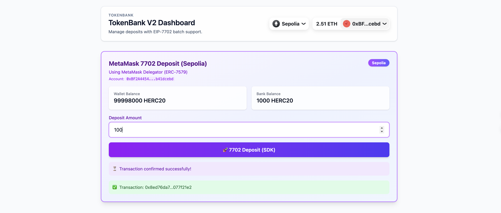

# TokenBank with EIP-7702 Support

A decentralized banking application implementing **EIP-7702** to enable seamless, one-click deposits via authorized account delegation. Verified on **Anvil (Prague Hardfork)** and **Sepolia Testnet**.



## 🌟 Features

### 🚀 EIP-7702 One-Click Deposit (Batch Execution)
Traditional ERC20 deposits require two transactions: `approve()` followed by `deposit()`.
Using **EIP-7702**, this project authorizes a temporary delegation to a smart contract, allowing your Externally Owned Account (EOA) to execute a **batch of calls** in a single transaction.

- **Single Transaction**: Authorize code code + `approve` + `deposit` all happen in one go.
- **Batching**: Calls are batched and executed atomically.
- **Delegation**: Your EOA temporarily adopts the code of a `Delegate` contract.

### 🏦 Standard Banking Features
- **Deposit**: Standard ERC20 deposit flow.
- **Withdraw**: Retrieve your tokens from the bank.
- **Transfer with Callback**: Support for `transferAndCall` ("HookERC20") for direct contract interaction.

## 🛠️ Tech Stack

- **Smart Contracts**: Solidity, Foundry
- **Frontend**: React, TypeScript, Wagmi, Viem, @metamask/smart-accounts-kit
- **Chain**: Anvil (Local Node) running `prague` hardfork

## 🏁 Getting Started

### Prerequisites
- [Foundry](https://book.getfoundry.sh/getting-started/installation)
- [Node.js](https://nodejs.org/) & [pnpm](https://pnpm.io/)

### 1. Start Local Blockchain
Start Anvil with the **Prague hardfork** to enable EIP-7702 support:

```bash
anvil --hardfork prague
```

### 2. Deploy Contracts
In a new terminal, deploy the contracts to your local node:

```bash
cd Contract
make deploy local
```
*Note: This script deploys `HookERC20`, `TokenBankV2`, and `Delegate` contracts.*

### 3. Configure Frontend
Navigate to the frontend directory:

```bash
cd ../Frontend
```

Create a `.env` file and configure your private key (REQUIRED for EIP-7702 signing):

```bash
# Example Local Key (Anvil Account #0)
VITE_PRIVATE_KEY=0xac0974bec39a17e36ba4a6b4d238ff944bacb478cbed5efcae784d7bf4f2ff80
```
*Note: Even when using MetaMask, the `signAuthorization` action currently requires a local private key because wallet extensions do not yet support the EIP-7702 JSON-RPC method.*

### 4. Run Application

```bash
pnpm install
pnpm dev
```

Open [http://localhost:5173](http://localhost:5173).

---

## 🌍 Sepolia Testnet Support

The application fully supports the **Sepolia Testnet** using **MetaMask Smart Accounts Kit** conventions.

### Prerequisite: Sepolia Configuration
To execute EIP-7702 transactions on Sepolia:
1.  **Fund your account**: Ensure the account corresponding to your `VITE_PRIVATE_KEY` has Sepolia ETH.
2.  **Environment**: The app uses `@metamask/smart-accounts-kit` to automatically resolve the official **EIP7702StatelessDeleGator** address.

### Deployed Contracts (Sepolia)
| Contract | Address |
|----------|---------|
| **TokenBankV2** | `0x3A730cf364BeDeB1f2b36bF823AC90e6d7f2f207` |
| **MyTokenV2** | `0xcf137BBFd546360bd09444D4761c5627A238D39A` |
| **Mask Delegator** | *Resolved dynamically via SDK* |

## 📖 How EIP-7702 Execution Works

1.  **Authorization**: The user signs an EIP-7702 authorization message locally. This delegates their EOA to reuse the code of the `Delegate` contract (or MetaMask's official Delegator on Sepolia).
2.  **Construction**: The frontend constructs a batch transaction.
    - **Sepolia**: Uses ERC-7579 `execute(ModeCode, ExecutionVals)` encoding.
    - **Anvil**: Uses simple struct array encoding.
3.  **Execution**: The transaction is sent using `sendTransaction` with the included `authorizationList`.
    - The transaction temporarily upgrades the EOA.
    - The batch is executed atomically.
    - **Executor**: Set to `'self'` to ensure proper nonce management.

## 🔍 Troubleshooting

**"Account type 'json-rpc' is not supported"**
- This confirms that you are trying to use EIP-7702 with a browser wallet extension (like MetaMask) directly.
- **Fix**: Ensure `VITE_PRIVATE_KEY` is set in `.env`. The app falls back to local signing for this specific action.

**"Transaction successful but no logs/events?"**
- Ensure you are using `executor: 'self'`.
- Ensure your Anvil node is running with `--hardfork prague`.