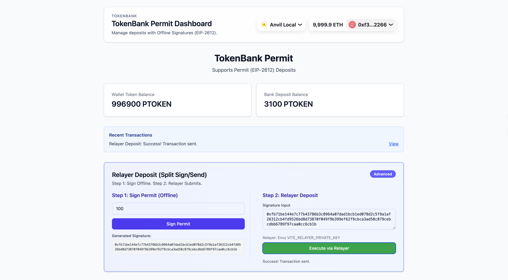

# TokenBank with EIP-2612 Permit



This project demonstrates a **TokenBank** application that leverages **EIP-2612 (ERC20 Permit)** to enable gasless approvals. It features a complete **Relayer** pattern where a user can sign a deposit authorization offline, and a separate "Relayer" account executes the transaction on chain, paying the gas fees.

## Features

- **PermitToken (PTOKEN)**: An ERC20 token implementing the EIP-2612 standard (using OpenZeppelin).
- **TokenBank**: A bank contract capable of:
  - Standard `deposit` and `withdraw`.
  - `permitDeposit` which accepts an offline signature to approve and deposit in a single transaction.
- **Relayer Deposit UI**:
  - **Split Sign/Send Flow**: Separates the signing process (user) from the execution (relayer).
  - **EIP-712 Signing**: Users sign a structured typed data message via MetaMask.
  - **Relayer Execution**: A configured backend/relayer account executes the deposit using the raw signature.

## Technology Stack

- **Smart Contracts**: Solidity, Foundry (Forge/Anvil).
- **Frontend**: React, Vite, TypeScript, Tailwind CSS.
- **Web3**: Wagmi, Viem, RainbowKit.

## Prerequisites

- [Foundry](https://book.getfoundry.sh/getting-started/installation) installed.
- [Node.js](https://nodejs.org/) & [pnpm](https://pnpm.io/) (or npm/yarn) installed.
- MetaMask wallet.

## Setup & Installation

1. **Clone the repository** (if not already done).

2. **Install Contract Dependencies**:
   ```bash
   cd Contract
   forge install
   ```

3. **Install Frontend Dependencies**:
   ```bash
   cd ../Frontend
   pnpm install
   ```

## Local Development & Verification

### 1. Start Local Blockchain
Start a local Anvil node in a terminal:
```bash
anvil
```

### 2. Deploy Contracts
In the `Contract` directory, run the deployment script:
```bash
make deploy local
# Or manually:
forge script script/DeployPermitTokenBank.s.sol --rpc-url http://127.0.0.1:8545 --private-key 0xac0974bec39a17e36ba4a6b4d238ff944bacb478cbed5efcae784d7bf4f2ff80 --broadcast
```
*Note the deployed addresses for `PermitToken` and `TokenBank`.*

### 3. Configure Frontend
Update `Frontend/src/constants/addresses.ts` with your deployed addresses.

Create or update `Frontend/.env` with a Relayer Private Key (you can use one of Anvil's pre-funded accounts, e.g., output #1):
```env
VITE_RELAYER_PRIVATE_KEY=0x59c6995e998f97a5a0044966f0945389dc9e86dae88c7a8412f4603b6b78690d
```

### 4. Run the App
```bash
cd Frontend
pnpm dev
```
Open [http://localhost:5173](http://localhost:5173) in your browser.

## How to Test Relayer Deposit

1. **Connect Wallet**: Connect your MetaMask (using Anvil Account #0 or any account *other* than the Relayer).
2. **Step 1: Sign Permit (Offline)**:
   - Enter an amount (e.g., "10").
   - Click **Sign Permit**.
   - MetaMask will prompt to sign an **EIP-712** message (not a transaction).
   - Once signed, a **65-byte signature string** will appear. Copy this string.
3. **Step 2: Relayer Deposit**:
   - Paste the copied signature into the input box.
   - Click **Execute via Relayer**.
   - The application will use the `VITE_RELAYER_PRIVATE_KEY` to submit the transaction.
   - **Verification**: Check the transaction on the explorer link provided. You will see the `From` address is the Relayer, but the Tokens were deducted from *your* account and deposited to the Bank under *your* name.