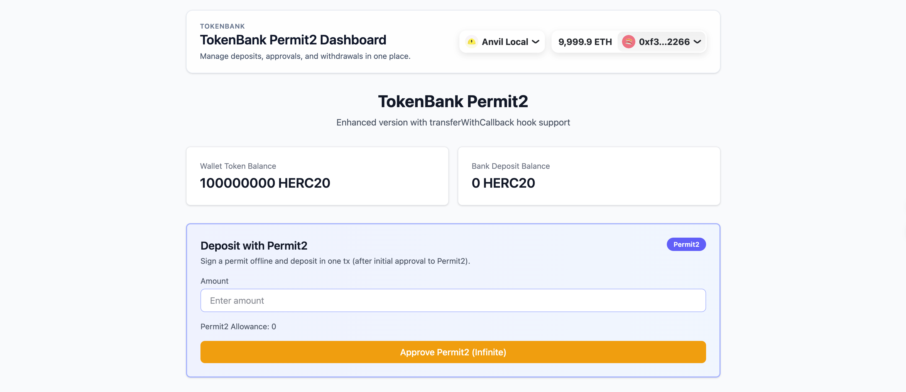
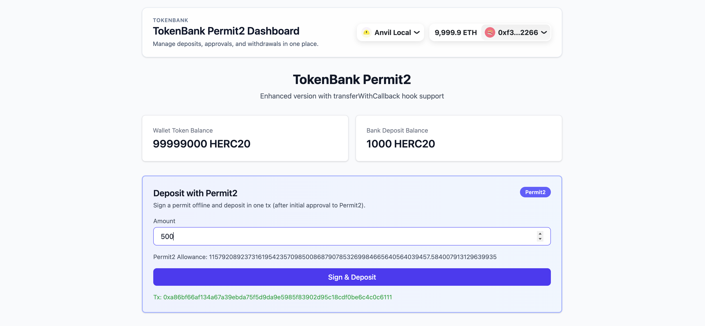

# TokenBank Permit2 Integration

This project demonstrates the integration of **Permit2** into a TokenBank application, enabling gas-optimized and streamlined deposit flows using EIP-712 signatures.

## Features

- **Deposit with Permit2**: Users can deposit tokens by signing an off-chain message (EIP-712), avoiding the need for a separate on-chain `approve` transaction for every deposit (after the initial infinite approval).
- **Infinite Approval Optimization**: The "Approve Permit2" step uses `maxUint256`. Once approved, the button disappears, and users can deposit seamlessly with just a signature.
- **Simplified Permit2 Contract**: A local, simplified version of the canonical Permit2 contract is used for demonstration purposes.
- **React + Wagmi + Viem**: Modern frontend stack for robust blockchain interaction.

## Screenshots

### 1. Approve Permit2 (First Time Only)
When using Permit2 for the first time, you need to approve it to spend your tokens. We use an infinite approval strategy to minimize future transaction costs.



### 2. Sign & Deposit
Once approved, you simply enter the amount and sign the typed data. The balance updates automatically upon confirmation.



## Technical Architecture

### Smart Contracts
- **`TokenBankPermit2`**: The main bank contract. It includes a `depositWithPermit2` function that calls `permitTransferFrom` on the Permit2 contract.
- **`Permit2` (Simplified)**: A mock implementation of Uniswap's Permit2, handling `permitTransferFrom` and EIP-712 signature verification.
- **`HookERC20`**: A standard ERC20 token used for testing.

### Frontend
- **`Permit2Deposit.tsx`**: Encapsulates the Permit2 logic. It manages:
  - Checking allowance.
  - Infinite approval transaction.
  - EIP-712 Typed Data signing.
  - Calling `depositWithPermit2` on the bank contract.
  - Auto-refreshing balances via `onSuccess` callback.

## Getting Started

### Prerequisites
- [Foundry](https://getfoundry.sh/) (for local chain and contract deployment)
- [Node.js](https://nodejs.org/) & [pnpm](https://pnpm.io/) (for frontend)

### 1. Start Local Chain
```bash
anvil
```

### 2. Deploy Contracts
In a new terminal, deploy the contracts to the local Anvil chain:
```bash
cd Contract
make deploy local
```

### 3. Start Frontend
In the `Frontend` directory:
```bash
pnpm install
pnpm dev
```

### 4. Interact
1.  Connect your wallet to **Localhost 8545**.
2.  Import an Anvil private key (e.g., Account #0) to get test tokens.
3.  Use the **Deposit with Permit2** section to test the flow.