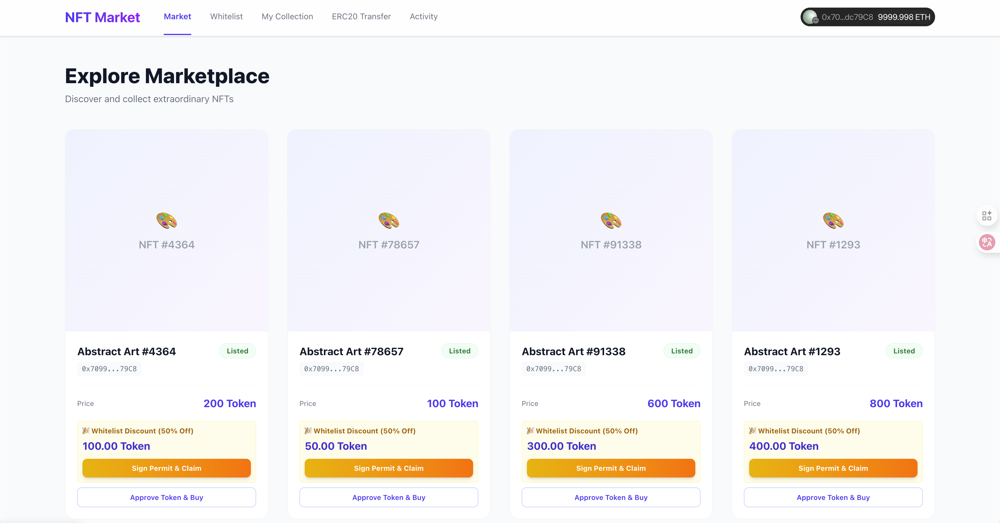

# AirdopMerkleNFTMarket - 混合式 NFT 市场

一个支持白名单折扣购买和普通购买的 NFT 市场，使用 Merkle Tree 进行白名单验证，结合 ERC20 Permit 实现无需预先授权的一键购买体验。

## 📸 功能截图

### Merkle Tree WhiteList


### Multicall Buy


---

## 🔧 技术实现原理

### 1. Merkle Tree 白名单验证

```
                    Root Hash
                   /         \
            Hash(A+B)       Hash(C+D)
           /       \       /       \
      Hash(A)  Hash(B)  Hash(C)  Hash(D)
         |        |        |        |
      Addr1    Addr2    Addr3    Addr4
```

- **Frontend**: 使用 `merkletreejs` 库根据白名单地址列表生成 Merkle Tree
- **Contract**: 存储 Merkle Root，使用 OpenZeppelin 的 `MerkleProof.verify()` 验证用户提交的 proof
- **优势**: Gas 效率高，只需存储一个 bytes32 根哈希，而非整个白名单列表

### 2. ERC20 Permit (EIP-2612)

传统流程:
```
用户 -> approve(spender, amount)  [Tx 1]
用户 -> buy()                      [Tx 2]
```

使用 Permit:
```
用户 -> 签名 Permit 消息 (链下)
用户 -> permitPrePay + claimNFT via Multicall [单笔 Tx]
```

- 用户签署 EIP-712 类型化数据，包含 `owner`, `spender`, `value`, `nonce`, `deadline`
- 合约调用 `token.permit()` 验证签名并设置授权
- 节省一笔 approve 交易的 Gas

### 3. Multicall 批量调用

```solidity
function multicall(bytes[] calldata data) external returns (bytes[] memory results);
```

将多个函数调用打包成一笔交易：
1. `permitPrePay()` - 验证签名并授权代币
2. `claimNFT()` - 验证白名单并完成购买

### 4. 合约架构

```
AirdopMerkleNFTMarket (Ownable, Multicall)
├── token: IERC20 (支付代币)
├── nft: IERC721 (NFT 合约)
├── merkleRoot: bytes32 (白名单根)
├── priceOfNft: mapping(tokenId => price)
│
├── list(tokenId, price)           // NFT 上架
├── setMerkleRoot(root)            // Owner 设置白名单
├── permitPrePay(...)              // Permit 授权
├── claimNFT(tokenId, proof)       // 白名单购买 (50%折扣)
└── buyNFT(tokenId)                // 普通购买 (原价)
```

---

## 🚀 测试步骤

### 环境准备

```bash
# 1. 启动本地区块链
cd Contract
anvil

# 2. 部署合约 (新终端)
make deploy local
# 记录输出的合约地址

# 3. 更新前端配置
# 编辑 Frontend/src/config/contracts.ts，填入部署的地址

# 4. 启动前端
cd ../Frontend
pnpm install
pnpm dev
```

### 测试流程

#### Step 1: 连接钱包
1. 打开 MetaMask，添加本地网络 (RPC: `http://127.0.0.1:8545`, Chain ID: `31337`)
2. 导入 Anvil 测试账户:
   - Account #0 (Owner): `0xf39Fd6e51aad88F6F4ce6aB8827279cffFb92266`
   - Account #1 (白名单用户): `0x70997970C51812dc3A010C7d01b50e0d17dc79C8`

#### Step 2: 设置 Merkle Root (Owner)
1. 使用 Account #0 连接网站
2. 进入 `/whitelist` 页面
3. 点击 **"⚡ Update Merkle Root"** 按钮
4. 确认交易

#### Step 3: 上架 NFT (Owner)
1. 进入首页 `/` (My Collection)
2. 点击 **"Approve Market"** 授权市场合约
3. 点击 **"List for Sale"**，输入价格 (如 `200`)
4. 确认交易

#### Step 4: 白名单购买 (50% 折扣)
1. 切换到 Account #1 (白名单用户)
2. 进入 `/market` 页面
3. 找到上架的 NFT，点击 **"Sign Permit & Claim"**
4. MetaMask 会弹出签名请求 (EIP-712)，确认签名
5. 确认交易，以 50% 折扣价购买成功

#### Step 5: 普通购买 (原价)
1. 使用非白名单账户连接
2. 进入 `/market` 页面
3. 点击 **"Approve Token & Buy"** (首次需授权)
4. 再次点击 **"Buy Normal"** 完成原价购买

---

## 📁 项目结构

```
AirdopMerkleNFTMarket/
├── Contract/
│   ├── src/
│   │   ├── AirdopMerkleNFTMarket.sol  # 主合约
│   │   ├── MyPermitToken.sol          # ERC20 Permit 代币
│   │   └── BaseERC721.sol             # NFT 合约
│   ├── script/
│   │   └── DeployAirdropMerkleNFTMarket.s.sol
│   ├── test/
│   └── Makefile
│
├── Frontend/
│   ├── src/
│   │   ├── components/
│   │   │   ├── NFTCard.tsx            # NFT 卡片 (购买逻辑)
│   │   │   └── Header.tsx
│   │   ├── pages/
│   │   │   ├── Market.tsx             # 市场页面
│   │   │   ├── Whitelist.tsx          # 白名单管理
│   │   │   └── Profile.tsx            # 个人收藏
│   │   ├── config/
│   │   │   ├── contracts.ts           # 合约地址与 ABI
│   │   │   └── whitelist.ts           # 白名单地址列表
│   │   └── wagmi.ts                   # Wagmi 配置
│   └── package.json
│
└── README.md
```

---

## 🛠 技术栈

| 层级 | 技术 |
|------|------|
| 智能合约 | Solidity, OpenZeppelin, Foundry |
| 前端框架 | React 19, TypeScript, Vite |
| 区块链交互 | Wagmi v2, Viem |
| 钱包连接 | Reown AppKit |
| 样式 | TailwindCSS v4 |
| Merkle Tree | merkletreejs, keccak256 |

---

## 📜 License

MIT
