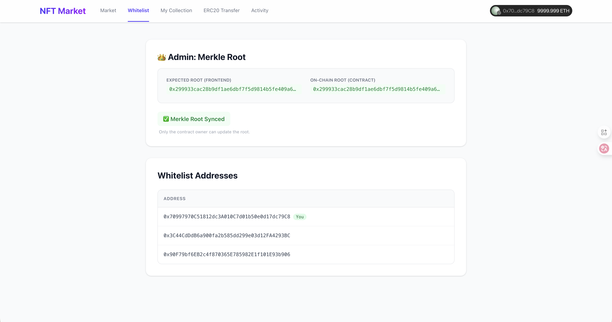

# NFT Market with Whitelist

This project implements an NFT Marketplace with a whitelist functionality using ECDSA signatures. Only authorized addresses (whitelisted via a signature from the contract owner) can purchase specific NFTs.

## 📸 Screenshots

### Buyer WhiteList


### Permit Buy


### Activity


## Features

- **Standard NFT Functions**: List, buy, and view NFTs.
- **Whitelist Integration**: 
  - `permitBuy` function in the smart contract allows purchases with a valid signature.
  - Signatures are generated off-chain by the owner.
  - Whitelist addresses are configured in the frontend.
- **Frontend Utility**:
  - **Whitelist Tab**: Automatically generates signatures for pre-configured addresses using the owner's private key (local dev only).
  - **Signature Copy**: Easy copy-paste of signatures for testing.
  - **Verification**: Verifies the signer matches the contract owner.
- **Error Handling**: Friendly error messages for invalid signatures or unauthorized access.

## Tech Stack

- **Smart Contracts**: Solidity, Foundry
- **Frontend**: React, Vite, Tailwind CSS, Wagmi/Viem

## Getting Started

### Prerequisites

- [Foundry](https://book.getfoundry.sh/getting-started/installation)
- [Node.js](https://nodejs.org/) & pnpm

### 1. Contract Setup

Navigate to the `Contract` directory:
```bash
cd Contract
forge install
forge build
```

Start a local Anvil chain:
```bash
anvil
```

Deploy contracts (example using forge script or manual deploy):
```bash
forge script script/Deploy.s.sol --rpc-url http://127.0.0.1:8545 --broadcast
```

### 2. Frontend Setup

Navigate to the `Frontend` directory:
```bash
cd Frontend
pnpm install
```

Configure Environment Variables:
Create a `.env` file in the `Frontend` directory:
```env
VITE_PROJECT_ID=your_walletconnect_project_id
VITE_MARKET_OWNER_KEY=your_anvil_private_key_0
```

Update Contract Addresses:
Update `src/config/contracts.ts` with your deployed contract addresses.

Run the development server:
```bash
pnpm dev
```

## Usage

1.  **Configure Whitelist**: Edit `src/config/whitelist.ts` to include the addresses you want to test.
2.  **Generate Signatures**: 
    - Go to the **Whitelist** tab in the app.
    - Copy the signature for your test address.
3.  **Buy NFT**:
    - Switch your wallet to the whitelisted address.
    - Go to **Market** -> Select an NFT -> Click **Buy (Whitelist)**.
    - Paste the signature and confirm.
