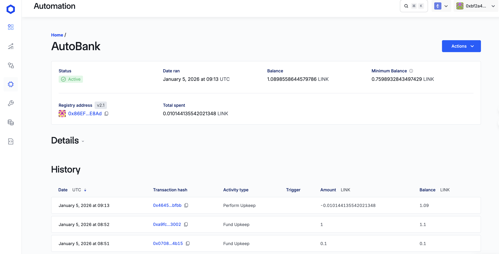
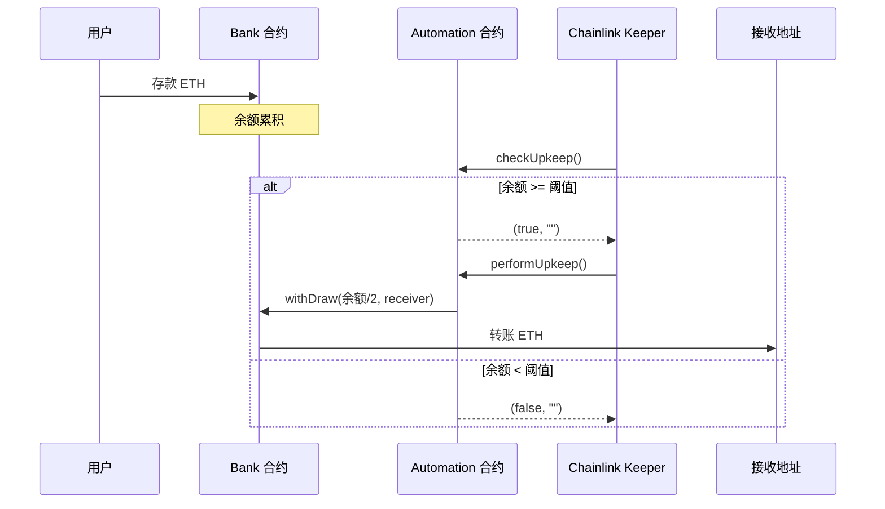

# AutoBank - Chainlink Automation 自动取款银行

基于 Chainlink Automation 的智能合约项目，当银行存款达到阈值时自动将一半余额转至指定地址。



## 项目结构

```
AutoBank/
├── src/
│   ├── Bank.sol          # 银行合约，接收存款并管理取款
│   └── Automation.sol    # Chainlink Automation 兼容合约
├── script/
│   └── Deploy.s.sol      # 部署脚本
├── test/
│   └── AutoBank.t.sol    # 测试用例
└── README.md
```

## 合约说明

### Bank.sol

银行合约，功能包括：
- 接收 ETH 存款（通过 `receive()` 函数）
- 管理员权限控制（`onlyAdmin` modifier）
- 取款功能（`withDraw`）

### Automation.sol

Chainlink Automation 兼容合约，实现：
- `checkUpkeep()`: 检测银行余额是否达到阈值
- `performUpkeep()`: 当条件满足时，转走银行一半余额到接收地址

## 工作流程



## 部署

### 本地测试

```bash
# 启动本地节点
make anvil

# 部署到本地
make deploy local
```

### Sepolia 测试网

```bash
make deploy sepolia
```

## 测试

```bash
forge test -vvv
```

测试用例覆盖：
- ✅ 余额低于阈值时 `checkUpkeep` 返回 false
- ✅ 余额达到/超过阈值时 `checkUpkeep` 返回 true
- ✅ 多用户存款累计达到阈值
- ✅ `performUpkeep` 正确转走一半余额
- ✅ 只有 Automation 合约能执行取款
- ✅ 完整流程测试

## Sepolia 部署地址

| 合约 | 地址 |
|------|------|
| Bank | [0xa358Da89C9229eB1ec42eEDAECF7A72F35A0258D](https://sepolia.etherscan.io/address/0xa358da89c9229eb1ec42eedaecf7a72f35a0258d) |
| Automation | [0x8bd43A9027bB5a9fB7f6A1D21f2Bc75720AD00ba](https://sepolia.etherscan.io/address/0x8bd43a9027bb5a9fb7f6a1d21f2bc75720ad00ba) |

## 在 Chainlink Automation 注册 Upkeep

1. 访问 [Chainlink Automation](https://automation.chain.link/)
2. 连接钱包并选择 Sepolia 网络
3. 点击 "Register new Upkeep"
4. 选择 "Custom logic" 触发器
5. 输入 Automation 合约地址
6. 设置 Gas Limit (建议 500,000)
7. 充值 LINK 代币

## 技术栈

- Solidity 0.8.30
- Foundry
- Chainlink Automation

## 测试日志

```sh
AutoBank git:(main) ✗ forge test -vvv
[⠊] Compiling...
No files changed, compilation skipped

Ran 8 tests for test/AutoBank.t.sol:AutoBankTest
[PASS] test_CheckUpkeep_AboveThreshold() (gas: 51326)
[PASS] test_CheckUpkeep_AtThreshold() (gas: 51306)
[PASS] test_CheckUpkeep_BelowThreshold() (gas: 51329)
[PASS] test_CompleteFlow() (gas: 186536)
Logs:
  
=== Starting Complete Flow Test ===

  Step 1: User1 deposits 50 gwei
    Bank balance: 50000000000
    Upkeep needed: false
  
Step 2: User2 deposits 30 gwei
    Bank balance: 80000000000
    Upkeep needed: false
  
Step 3: User3 deposits 25 gwei
    Bank balance: 105000000000
    Upkeep needed: true
  
Step 4: Chainlink Automation calls performUpkeep
    Bank balance after: 52500000000
    Receiver balance after: 52500000000
    Amount transferred: 52500000000
  
  After withdrawal, upkeep needed: false
  
=== Complete Flow Test Passed! ===


[PASS] test_MultipleUsers_DepositUntilThreshold() (gas: 126233)
Logs:
  Bank balance after all deposits: 100000000000

[PASS] test_OnlyAutomationCanWithdraw() (gas: 54409)
[PASS] test_PerformUpkeep_WithdrawsHalf() (gas: 100825)
Logs:
  Bank balance before performUpkeep: 200000000000
  Receiver balance before performUpkeep: 0
  Bank balance after performUpkeep: 100000000000
  Receiver balance after performUpkeep: 100000000000

[PASS] test_SetWithdrawThreshold() (gas: 58427)
Suite result: ok. 8 passed; 0 failed; 0 skipped; finished in 8.25ms (9.67ms CPU time)

Ran 1 test suite in 4.02s (8.25ms CPU time): 8 tests passed, 0 failed, 0 skipped (8 total tests)
```

## 部署日志

```sh
 AutoBank git:(main) ✗ make deploy sepolia
================================================
Deploying contract to sepolia
Account: shaoguoji
Verify: Yes
================================================
forge script script/Deploy.s.sol \
                --rpc-url sepolia \
                --account shaoguoji \
                --broadcast \
                --verify
[⠊] Compiling...
No files changed, compilation skipped
Enter keystore password:
Script ran successfully.

== Logs ==
  Bank deployed to:  0xa358Da89C9229eB1ec42eEDAECF7A72F35A0258D
  Automation deployed to:  0x8bd43A9027bB5a9fB7f6A1D21f2Bc75720AD00ba

## Setting up 1 EVM.

==========================

Chain 11155111

Estimated gas price: 0.00100002 gwei

Estimated total gas used for script: 1164534

Estimated amount required: 0.00000116455729068 ETH

==========================

##### sepolia
✅  [Success] Hash: 0x0ea20d39319ee97b189fd723ceaf0cbabfedb97fcac7ce60978394dc9ba844c4
Contract Address: 0xa358Da89C9229eB1ec42eEDAECF7A72F35A0258D
Block: 9982871
Paid: 0.0000003916239162 ETH (391620 gas * 0.00100001 gwei)


##### sepolia
✅  [Success] Hash: 0x8f7294191b944935a59e2d9314c0f4fb78ba625e03a30d315df08fc3fb0a7064
Contract Address: 0x8bd43A9027bB5a9fB7f6A1D21f2Bc75720AD00ba
Block: 9982873
Paid: 0.00000047371373709 ETH (473709 gas * 0.00100001 gwei)


##### sepolia
✅  [Success] Hash: 0x3826c6f5da527e999cb39b9045bcee7c648fbd03211646c03fb19bd7ecb48ff0
Block: 9982875
Paid: 0.000000027082297902 ETH (27082 gas * 0.001000011 gwei)

✅ Sequence #1 on sepolia | Total Paid: 0.000000892419951192 ETH (892411 gas * avg 0.00100001 gwei)
                                                                                                                        

==========================

ONCHAIN EXECUTION COMPLETE & SUCCESSFUL.
##
Start verification for (2) contracts
Start verifying contract `0xa358Da89C9229eB1ec42eEDAECF7A72F35A0258D` deployed on sepolia
EVM version: prague
Compiler version: 0.8.30

Submitting verification for [src/Bank.sol:Bank] 0xa358Da89C9229eB1ec42eEDAECF7A72F35A0258D.
Submitted contract for verification:
        Response: `OK`
        GUID: `gjt8qflwqt5u5g8meuetzkpyq4ucxqqgw2krl45lvs4bqxapip`
        URL: https://sepolia.etherscan.io/address/0xa358da89c9229eb1ec42eedaecf7a72f35a0258d
Contract verification status:
Response: `OK`
Details: `Pass - Verified`
Contract successfully verified
Start verifying contract `0x8bd43A9027bB5a9fB7f6A1D21f2Bc75720AD00ba` deployed on sepolia
EVM version: prague
Compiler version: 0.8.30
Constructor args: 000000000000000000000000a358da89c9229eb1ec42eedaecf7a72f35a0258d0000000000000000000000001804c8ab1f12e6bbf3894d4083f33e07309d1f38000000000000000000000000000000000000000000000000000000174876e800

Submitting verification for [src/Automation.sol:Automation] 0x8bd43A9027bB5a9fB7f6A1D21f2Bc75720AD00ba.
Submitted contract for verification:
        Response: `OK`
        GUID: `e1kvcvvuikmaxzcpy4whabqsxzhdzsuvi9bpxzqqvhmjrluwab`
        URL: https://sepolia.etherscan.io/address/0x8bd43a9027bb5a9fb7f6a1d21f2bc75720ad00ba
Contract verification status:
Response: `NOTOK`
Details: `Pending in queue`
Warning: Verification is still pending...; waiting 15 seconds before trying again (7 tries remaining)
Contract verification status:
Response: `OK`
Details: `Pass - Verified`
Contract successfully verified
All (2) contracts were verified!

Transactions saved to: /Users/shaoguoji/ETHChiangMai_Bootcamp/Homework/Day19/AutoBank/broadcast/Deploy.s.sol/11155111/run-latest.json

Sensitive values saved to: /Users/shaoguoji/ETHChiangMai_Bootcamp/Homework/Day19/AutoBank/cache/Deploy.s.sol/11155111/run-latest.json
```