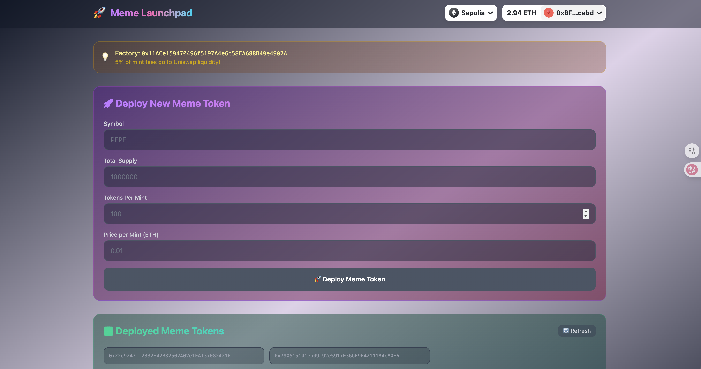
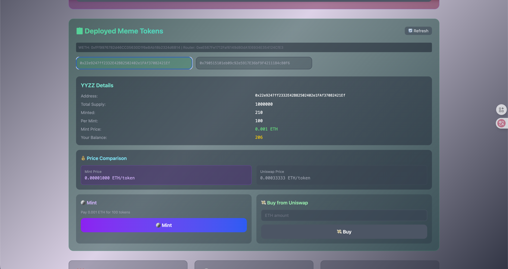

# Meme Launchpad 🚀

A decentralized meme token launchpad with automatic Uniswap V2 liquidity provision.





## Features

- **Deploy Meme Tokens**: Create new ERC20 meme tokens using minimal proxy (EIP-1167)
- **Fair Mint**: Users pay ETH to mint tokens, 5% of fees auto-add to Uniswap liquidity
- **Buy from Uniswap**: Purchase tokens directly via Uniswap swap
- **Price Comparison**: Frontend shows mint price vs Uniswap price

## Architecture

```
LaunchPadUniswap/
├── Contract/           # Foundry smart contracts
│   ├── src/
│   │   ├── MemeFactory.sol      # Factory contract with deployMeme, mintMeme, buyMeme
│   │   ├── MemeToken.sol        # ERC20 token implementation (clone template)
│   │   └── interfaces/          # Uniswap V2 Router interface
│   ├── script/Deploy.s.sol      # Deployment script
│   └── test/                    # Foundry tests
└── Frontend/           # React + Vite + Wagmi
    ├── src/
    │   ├── components/
    │   │   ├── DeployMeme.tsx         # Deploy new token form
    │   │   └── DeployedMemeList.tsx   # Token list with mint/buy
    │   ├── contracts.ts               # ABIs and addresses
    │   └── wagmi.ts                   # Web3 config
    └── .env                           # VITE_PROJECT_ID (WalletConnect)
```

## Smart Contracts

### MemeFactory

| Function | Description |
|----------|-------------|
| `deployMeme(symbol, totalSupply, perMint, price)` | Deploy new meme token |
| `mintMeme(tokenAddr)` | Mint tokens (5% fee → liquidity) |
| `buyMeme(tokenAddr)` | Buy via Uniswap swap |
| `getDeployedMemes()` | Get all deployed token addresses |

### Fee Mechanics

```
User pays 0.01 ETH to mint 100 tokens
├── 95% (0.0095 ETH) → Token issuer
└── 5% (0.0005 ETH) → Uniswap liquidity pool
    └── Mints equivalent tokens for LP pair
```

## Deployment

### 1. Deploy Contracts

```bash
cd Contract

# Install dependencies
forge install

# Deploy to Sepolia
make deploy sepolia
```

### 2. Run Frontend

```bash
cd Frontend

# Install dependencies
pnpm install

# Create .env file
echo "VITE_PROJECT_ID=your_walletconnect_project_id" > .env

# Start dev server
pnpm dev
```

Get WalletConnect Project ID from: https://cloud.walletconnect.com/

## Sepolia Deployment

- **MemeFactory**: Check `Frontend/src/contracts.ts` for current address
- **Uniswap V2 Router**: `0xeE567Fe1712Faf6149d80dA1E6934E354124CfE3`

## Testing

```bash
cd Contract
forge test -vvv
```

## Tech Stack

- **Smart Contracts**: Solidity, Foundry, OpenZeppelin
- **Frontend**: React, Vite, TypeScript, Tailwind CSS
- **Web3**: Wagmi, RainbowKit, Viem
- **DEX**: Uniswap V2

## License

MIT
