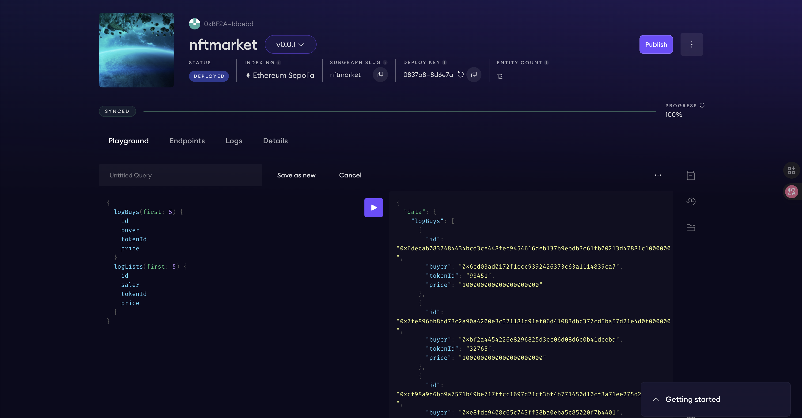

# NFT Market Subgraph
## Contract Info
- **Contract Address** (Sepolia): `0xd4ADe8031E01492bE106335C7B5Eed81cd7A29fD`
- **Events**:
    - `logBuy(address,uint256,uint256)`
    - `logList(address,uint256,uint256)`
    - `logTokensReceived(address,uint256,bytes)`

## scrennshot



## build log

```
➜  nftmarket-subgraph git:(main) ✗ graph codegen && graph build
  Skip migration: Bump mapping apiVersion from 0.0.1 to 0.0.2
  Skip migration: Bump mapping apiVersion from 0.0.2 to 0.0.3
  Skip migration: Bump mapping apiVersion from 0.0.3 to 0.0.4
  Skip migration: Bump mapping apiVersion from 0.0.4 to 0.0.5
  Skip migration: Bump mapping apiVersion from 0.0.5 to 0.0.6
  Skip migration: Bump manifest specVersion from 0.0.1 to 0.0.2
  Skip migration: Bump manifest specVersion from 0.0.2 to 0.0.4
✔ Apply migrations
✔ Load subgraph from subgraph.yaml
  Load contract ABI from abis/NFTMarket.json
✔ Load contract ABIs
  Generate types for contract ABI: NFTMarket (abis/NFTMarket.json)
  Write types to generated/NFTMarket/NFTMarket.ts
✔ Generate types for contract ABIs
✔ Generate types for data source templates
✔ Load data source template ABIs
✔ Generate types for data source template ABIs
✔ Load GraphQL schema from schema.graphql
  Write types to generated/schema.ts
✔ Generate types for GraphQL schema

Types generated successfully

  Skip migration: Bump mapping apiVersion from 0.0.1 to 0.0.2
  Skip migration: Bump mapping apiVersion from 0.0.2 to 0.0.3
  Skip migration: Bump mapping apiVersion from 0.0.3 to 0.0.4
  Skip migration: Bump mapping apiVersion from 0.0.4 to 0.0.5
  Skip migration: Bump mapping apiVersion from 0.0.5 to 0.0.6
  Skip migration: Bump manifest specVersion from 0.0.1 to 0.0.2
  Skip migration: Bump manifest specVersion from 0.0.2 to 0.0.4
✔ Apply migrations
✔ Load subgraph from subgraph.yaml
  Compile data source: NFTMarket => build/NFTMarket/NFTMarket.wasm
✔ Compile subgraph
  Copy schema file build/schema.graphql
  Write subgraph file build/NFTMarket/NFTMarket.json
  Write subgraph manifest build/subgraph.yaml
✔ Write compiled subgraph to build/

Build completed: build/subgraph.yaml
```

## deploy log

```
➜  nftmarket-subgraph git:(main) ✗ graph deploy nftmarket
✔ Which version label to use? (e.g. "v0.0.1") · v0.0.1
  Skip migration: Bump mapping apiVersion from 0.0.1 to 0.0.2
  Skip migration: Bump mapping apiVersion from 0.0.2 to 0.0.3
  Skip migration: Bump mapping apiVersion from 0.0.3 to 0.0.4
  Skip migration: Bump mapping apiVersion from 0.0.4 to 0.0.5
  Skip migration: Bump mapping apiVersion from 0.0.5 to 0.0.6
  Skip migration: Bump manifest specVersion from 0.0.1 to 0.0.2
  Skip migration: Bump manifest specVersion from 0.0.2 to 0.0.4
✔ Apply migrations
✔ Load subgraph from subgraph.yaml
  Compile data source: NFTMarket => build/NFTMarket/NFTMarket.wasm
✔ Compile subgraph
  Copy schema file build/schema.graphql
  Write subgraph file build/NFTMarket/NFTMarket.json
  Write subgraph manifest build/subgraph.yaml
✔ Write compiled subgraph to build/
  Add file to IPFS build/schema.graphql
                .. QmNpQrrYnWDn7cxmJBMEfZkYy5TQzoQY8pShF2EDYhwZVy
  Add file to IPFS build/NFTMarket/NFTMarket.json
                .. QmW7bcA4jUWYhBkT2EeZZf4ZkFbxE8PF93F5LLZFp5um1E
  Add file to IPFS build/NFTMarket/NFTMarket.wasm
                .. QmdJYpk45avgMa1nmxqHjwNKisbDXuabXCfx8VSsE6DUwn
✔ Upload subgraph to IPFS

Build completed: QmTDhictA2XLPxBeXpp7MMC5z9WZpduQcvCCm3M1LAiqPw

Deployed to https://thegraph.com/studio/subgraph/nftmarket

Subgraph endpoints:
Queries (HTTP):     https://api.studio.thegraph.com/query/1723130/nftmarket/v0.0.1
```

## Directory Structure

*   **`abis/`**: Contains the JSON ABI files for the smart contracts (e.g., `NFTMarket.json`). These are used by the graph to know which events to listen for.
*   **`src/`**: Contains the AssemblyScript code (e.g., `nft-market.ts`) that handles the event mappings. This is where you write the logic to transform smart contract events into the entities defined in your schema.
*   **`tests/`**: Contains unit tests for your subgraph mappings, typically using the Matchstick testing framework.
*   **`schema.graphql`**: The GraphQL schema file that defines the data entities (tables) that your subgraph will store and serve.
*   **`subgraph.yaml`**: The manifest file that defines the subgraph's configuration, including which contracts to index, which network to use, and mapping of events to handlers.
*   **`generated/`**: Contains automatically generated Typescript types based on your ABI and Schema. **Do not modify these files manually**; they are rebuilt with `graph codegen`.
*   **`build/`**: The output directory containing the compiled subgraph logic (WASM) and other build artifacts ready for deployment.

## Modification Guide

To update or extend this subgraph, follow these steps:

1.  **Modify Schema**: If you need to store new data, update `schema.graphql` to define new entities or fields.
2.  **Update Manifest**: If you are adding a new event listener or changing the contract address, update `subgraph.yaml`.
3.  **Generate Types**: Run the codegen command to update the TypeScript types in the `generated/` folder.
    ```bash
    graph codegen
    ```
4.  **Implement Logic**: Write or update the event handlers in `src/nft-market.ts` (or other files in `src/`) to map the event data to your entities.
5.  **Build**: Compile the subgraph to ensure there are no errors.
    ```bash
    graph build
    ```
6.  **Deploy**: Deploy the updated subgraph to the Graph Studio or your hosted service.
    ```bash
    graph deploy nftmarket
    ```
