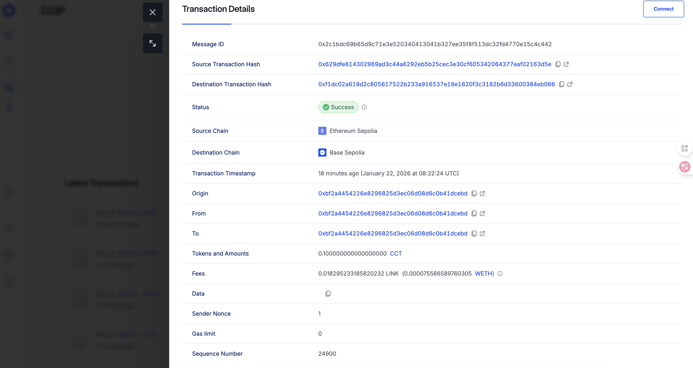

# Foundry DeFi Project - CCIP Bridge Module



最新跨链记录（Sepolia → Base Sepolia，0.1 CCT）: https://ccip.chain.link/#/side-drawer/msg/2c1bdc69b65d9c71e3e520340413041b327ee35f8f513dc32fd4770e15c4c442

基于 Foundry 的 Chainlink CCIP 跨链桥项目，实现 Sepolia ↔ Base Sepolia 双向跨链。

## 📋 目录

- [技术栈](#技术栈)
- [CCIP Bridge 模块](#ccip-bridge-模块)
- [快速开始](#快速开始)
- [部署指南](#部署指南)
- [验证和测试](#验证和测试)
- [自定义指南](#自定义指南)
- [故障排除](#故障排除)

## 🛠 技术栈

- **Foundry** - 以太坊开发工具链
- **Solidity 0.8.24** - 智能合约语言
- **Chainlink CCIP** - 跨链互操作协议
- **OpenZeppelin** - 安全合约库

### Chainlink 依赖

- `@chainlink/contracts@1.4.0` - Chainlink 核心合约
- `@chainlink/contracts-ccip@1.6.0` - CCIP 协议合约

## 🌉 CCIP Bridge 模块

### 概述

使用 **Chainlink CCIP** (Cross-Chain Interoperability Protocol) 实现 **Sepolia ↔ Base Sepolia** 双向跨链，采用 **Burn-Mint Token 模型**。

### 核心机制

**Burn-Mint 模型**:
- **源链**: Burn (销毁) CCT Token
- **目标链**: Mint (铸造) CCT Token
- **总供应量**: 保持恒定（burn 和 mint 数量相等）

### 已部署合约

#### Sepolia 测试网

| 合约类型 | 地址 |
|---------|------|
| CrossChainToken (CCT) | `0xAF8E5D63c45925a201bDd824c3452CF77D92bFF8` |
| BurnMintTokenPool | `0xc33F9B759f4f3b410DC4F1D4d6493619C1d1f1bF` |
| CCIP Router | `0x0BF3dE8c5D3e8A2B34D2BEeB17ABfCeBaf363A59` |
| Token Admin Registry | `0x95F29FEE11c5C55d26cCcf1DB6772DE953B37B82` |
| Chain Selector | `16015286601757825753` |

#### Base Sepolia 测试网

| 合约类型 | 地址 |
|---------|------|
| CrossChainToken (CCT) | `0x2be47261554ce80f6f2cC7490B072506eE20ca46` |
| BurnMintTokenPool | `0xf499E1Fc5978fa1BC848c49c158eF2dB4B941FBA` |
| CCIP Router | `0xD3b06cEbF099CE7DA4AcCf578aaebFDBd6e88a93` |
| Token Admin Registry | `0x6554c6fbd1c8f5b163a64183de8b9c1bd8e69016` |
| Chain Selector | `10344971235874465080` |

### 成功验证

**跨链测试结果** (2026-01-22):
```
源链 (Sepolia):   铸造 1000 CCT -> 0xBF2A4454226E8296825d3eC06d08D6c0b41dcebd；随后跨 0.1 CCT
目标链 (Base):    0.1 CCT（Burn → Mint），以 CCIP Explorer 状态为准
Message ID:       0x2c1bdc69b65d9c71e3e520340413041b327ee35f8f513dc32fd4770e15c4c442
监控脚本:         本地多轮检查 (至 #14) 余额为 0，最终以 Explorer 记录为准
CCIP Explorer:    https://ccip.chain.link/msg/2c1bdc69b65d9c71e3e520340413041b327ee35f8f513dc32fd4770e15c4c442
```

## 🚀 快速开始

### 前置要求

- **Foundry** - 安装: `curl -L https://foundry.paradigm.xyz | bash && foundryup`
- **Node.js 18+** - 用于 npm 包管理
- **钱包私钥** - 用于部署和交互
- **测试网 ETH** - Sepolia 和 Base Sepolia 测试币

### 安装

```bash
# 克隆项目
git clone <your-repo-url>
cd foundry-demo

# 安装 Foundry 依赖
forge install

# 安装 Chainlink npm 包
npm install @chainlink/contracts@1.4.0 @chainlink/contracts-ccip@1.6.0

# 配置环境变量
cp .env.example .env
# 编辑 .env 填入你的私钥和 RPC URLs
```

### 环境变量配置

创建 `.env` 文件:

```bash
# 私钥 (不要提交到 Git!)
PRIVATE_KEY=your_private_key_here

# RPC URLs
SEPOLIA_RPC_URL=https://sepolia.infura.io/v3/YOUR_INFURA_KEY
BASE_SEPOLIA_RPC_URL=https://sepolia.base.org

# Etherscan API Keys (用于验证合约)
ETHERSCAN_API_KEY=your_etherscan_api_key
BASESCAN_API_KEY=your_basescan_api_key
```

## 📖 部署指南

### 完整部署流程（结合本次终端日志）

每一步包含命令、日志输出节选与技术说明，便于复现或对照排错。

#### 步骤 1: 部署 Sepolia Token

```bash
forge script script/ccip/DeployToken.s.sol \
  --rpc-url $SEPOLIA_RPC_URL \
  --private-key $PRIVATE_KEY \
  --broadcast
```

**执行输出（节选）**
- 合约: 0xAF8E5D63c45925a201bDd824c3452CF77D92bFF8（Tx: 0xe89b026a6e19769a8049fb2e7f240aab1a2fd72bf2d6b39bc4f3c7d78fb130e4，次交易 0x36b3c295defff6de4ba5b5bc770141ad8ce98aafca4411f67945525856809148）
- Gas 支付: ~0.00152 ETH（1411097 gas，均价 ~1.05 gwei）
- 验证: https://sepolia.etherscan.io/address/0xaf8e5d63c45925a201bdd824c3452cf77d92bff8

**技术说明**
- 部署 BurnMintERC20（CCT），授予 CCIP Admin `0xBF2A4454226E8296825d3eC06d08D6c0b41dcebd` 的 mint/burn 角色。
- 地址写入 `script/ccip/output/deployedToken_ethereumSepolia.json`，供后续脚本读取；验证若 Pending，等待几秒自动重试。

---

#### 步骤 2: 部署 Base Sepolia Token

```bash
forge script script/ccip/DeployToken.s.sol \
  --rpc-url $BASE_SEPOLIA_RPC_URL \
  --private-key $PRIVATE_KEY \
  --broadcast
```

**执行输出（节选）**
- 合约: 0x2be47261554ce80f6f2cC7490B072506eE20ca46（Tx: 0xe5fb54db386a0cb8d3a84ba827980d04a87127f2adf7704b94333832374e1840，授权 Tx: 0x50cbe2f4883b679be9a560a17ef18d8a4b141fe7c15c8f9dc603860b1fe7400e）
- Gas 支付: ~0.00000169 ETH（1411097 gas，均价 ~0.0012 gwei）
- 验证: https://sepolia.basescan.org/address/0x2be47261554ce80f6f2cc7490b072506ee20ca46

**技术说明**
- 与步骤 1 相同逻辑，地址写入 `script/ccip/output/deployedToken_baseSepolia.json`，方便后续池子与权限脚本引用。

---

#### 步骤 3: 部署 Sepolia TokenPool

```bash
forge script script/ccip/DeployBurnMintTokenPool.s.sol \
  --rpc-url $SEPOLIA_RPC_URL \
  --private-key $PRIVATE_KEY \
  --broadcast
```

**执行输出（节选）**
- 池子: 0xc33F9B759f4f3b410DC4F1D4d6493619C1d1f1bF（创建 Tx: 0x0ddea05a0177b2995414f6a61d31581ce61f3e5c64c21e6d4463d980a511cf57，授权 Tx: 0x17d01031be093e4a493ef5bd3ebceabecb56b6f4245aa2ed1120e7a0d3ff8ca2）
- 验证: https://sepolia.etherscan.io/address/0xc33f9b759f4f3b410dc4f1d4d6493619c1d1f1bf

**技术说明**
- BurnMintTokenPool 绑定 token `0xAF8E...`、router `0x0BF3...`、RMN `0xba3f...`，并授予池子 mint/burn 权限。
- 地址写入 `script/ccip/output/deployedTokenPool_ethereumSepolia.json`，供 SetPool/跨链配置使用。

---

#### 步骤 4: 部署 Base Sepolia TokenPool

```bash
forge script script/ccip/DeployBurnMintTokenPool.s.sol \
  --rpc-url $BASE_SEPOLIA_RPC_URL \
  --private-key $PRIVATE_KEY \
  --broadcast
```

**执行输出（节选）**
- 池子: 0xf499E1Fc5978fa1BC848c49c158eF2dB4B941FBA（创建 Tx: 0x5e3fb0bbea635780d047ed4a1804a5363ea9ef041b552926d9bd1d6af7549d5f，授权 Tx: 0x6b283f4f027b484d1f74fca2e37a0ed126b98f6827a3e1b0ad6b159d7e19b695）
- 验证: https://sepolia.basescan.org/address/0xf499e1fc5978fa1bc848c49c158ef2db4b941fba

**技术说明**
- 同步骤 3，绑定 Base Sepolia router `0xD3b0...`、RMN `0x993607...`，并写入 `deployedTokenPool_baseSepolia.json`。

---

#### 步骤 5: Claim Admin（Sepolia）

```bash
forge script script/ccip/ClaimAdmin.s.sol \
  --rpc-url $SEPOLIA_RPC_URL \
  --private-key $PRIVATE_KEY \
  --broadcast
```

**执行输出（节选）**
- 初次与再次尝试因 `getCCIPAdmin()` 返回 `0xBF2A...` 而配置为 `0x0b33...` 时触发 revert，调整 `BnMToken.ccipAdminAddress` 至 `0xBF2A...` 后成功。
- 成功 Tx: 0x99b24964743067c6f0e9ecb0b38cdb5405870b952fd37b90b031a3c3d8def167

**技术说明**
- 将 token 的 CCIP 管理权领取到配置的 admin，确保后续 AcceptAdminRole 能完成权限迁移。

---

#### 步骤 6: Claim Admin（Base Sepolia）

```bash
forge script script/ccip/ClaimAdmin.s.sol \
  --rpc-url $BASE_SEPOLIA_RPC_URL \
  --private-key $PRIVATE_KEY \
  --broadcast
```

**执行输出（节选）**
- 成功 Tx: 0x31d473ab7c26c69d81ed8742e5c99d80dbbce0328fdeff725b123cfc728aa0ed

**技术说明**
- 与步骤 5 相同逻辑，确保 Base Sepolia token 的 CCIP admin 与配置保持一致。

---

#### 步骤 7: Accept Admin Role（Sepolia）

```bash
forge script script/ccip/AcceptAdminRole.s.sol \
  --rpc-url $SEPOLIA_RPC_URL \
  --private-key $PRIVATE_KEY \
  --broadcast
```

**执行输出**: 0x99f0a2f549aa5221d71e0b37e7a17dd3066bca4144e8b2d1266e4d270cd427f0

**技术说明**
- 接受 CCIP admin 角色变更，完成 token 权限的二步交接。

---

#### 步骤 8: Accept Admin Role（Base Sepolia）

```bash
forge script script/ccip/AcceptAdminRole.s.sol \
  --rpc-url $BASE_SEPOLIA_RPC_URL \
  --private-key $PRIVATE_KEY \
  --broadcast
```

**执行输出**: 0x739bdccda7228b2cc83a8f1731350a68ed19745b8aca99d6a44d2e22992ef2cb

**技术说明**
- 与步骤 7 相同，完成 Base 侧 token 权限落地。

---

#### 步骤 9: Set Pool（两条链）

```bash
# Sepolia
forge script script/ccip/SetPool.s.sol \
  --rpc-url $SEPOLIA_RPC_URL \
  --private-key $PRIVATE_KEY \
  --broadcast

# Base Sepolia
forge script script/ccip/SetPool.s.sol \
  --rpc-url $BASE_SEPOLIA_RPC_URL \
  --private-key $PRIVATE_KEY \
  --broadcast
```

**执行输出（节选）**
- Sepolia: 将 token 0xAF8E... 绑定池 0xc33F...；Tx 0xde2ca1eabb4a555303f5494ebd954566333928f78149b03663f76bc2a61325d1
- Base: 将 token 0x2be4... 绑定池 0xf499...；Tx 0xb76c877b5c919ffffc2b2bb5dcadce4f1c4bfc7b8ab6ba840b348ffca8e5d0d5

**技术说明**
- Token → Pool 映射写入合约，后续跨链时 Burn/Mint 将委托给对应池子。

---

#### 步骤 10: Apply Chain Updates（配置跨链路由）

```bash
# Sepolia (配置到 Base Sepolia 的路由)
forge script script/ccip/ApplyChainUpdates.s.sol \
  --rpc-url $SEPOLIA_RPC_URL \
  --private-key $PRIVATE_KEY \
  --broadcast

# Base Sepolia (配置到 Sepolia 的路由)
forge script script/ccip/ApplyChainUpdates.s.sol \
  --rpc-url $BASE_SEPOLIA_RPC_URL \
  --private-key $PRIVATE_KEY \
  --broadcast
```

**执行输出（节选）**
- Sepolia Tx: 0xe7ce15f86c75e96a969ae070c287c61e719cb39a8e6df3045d472c40c00a029d（池 0xc33F... 已更新）
- Base Tx: 0x92659a9f53f071eda16096b3daf0ad3bd6990860e4a726dbeaff33e7cabe0740（池 0xf499... 已更新）

**技术说明**
- 将远端链 selector 与 remote token/pool 写入池子，确保 CCIP Router 能在两条链间互通；两边都要执行才生效。

---

### 配置文件

**`script/ccip/config.json`（本次执行使用）**:
```json
{
  "BnMToken": {
    "name": "CrossChainToken",
    "symbol": "CCT",
    "decimals": 18,
    "maxSupply": 0,
    "preMint": 0,
    "ccipAdminAddress": "0xBF2A4454226E8296825d3eC06d08D6c0b41dcebd"
  },
  "tokenAmountToMint": 1000000000000000000000,
  "tokenAmountToTransfer": 100000000000000000,
  "feeType": "native",
  "remoteChains": {
    "11155111": 84532,
    "84532": 11155111
  }
}
```

**远端 token/pool 映射（来自部署日志）**
- Sepolia -> Base: `remoteToken` 0x2be47261554ce80f6f2cC7490B072506eE20ca46，`remotePool` 0xf499E1Fc5978fa1BC848c49c158eF2dB4B941FBA
- Base -> Sepolia: `remoteToken` 0xAF8E5D63c45925a201bDd824c3452CF77D92bFF8，`remotePool` 0xc33F9B759f4f3b410DC4F1D4d6493619C1d1f1bF

## 🧪 验证和测试

### 铸造测试代币

```bash
forge script script/ccip/MintTokens.s.sol \
  --rpc-url $SEPOLIA_RPC_URL \
  --private-key $PRIVATE_KEY \
  --broadcast
```

**执行输出**: 向 `0xBF2A4454226E8296825d3eC06d08D6c0b41dcebd` 铸造 `1000000000000000000000`（1000 CCT）；Tx: `0x134ce4c811c60e2d2f0fc81b4db026551fc844cc2104f54441051bb5cba072c4`，余额校验返回 1000 CCT。

**技术说明**
- 金额来自 `tokenAmountToMint`，可在 `config.json` 修改。
- 脚本会等待确认并打印新余额，确保后续跨链有足够余额。

---

### 执行跨链转账

```bash
forge script script/ccip/TransferTokens.s.sol \
  --rpc-url $SEPOLIA_RPC_URL \
  --private-key $PRIVATE_KEY \
  --broadcast
```

从 Sepolia 跨 0.1 CCT 到 Base Sepolia。

**执行输出（节选）**
- 预估费用: 75566589760305 wei (native)
- Message ID: `0x2c1bdc69b65d9c71e3e520340413041b327ee35f8f513dc32fd4770e15c4c442`
- 交易: 0xce6eedf6b392884f71ae260c228ef9440c8e455892b4dfa13d834abf54f2aa57（预估费用）; 0x629dfe614302969ad3c44a6292eb5b25cec3e30cf605342064377eaf02163d5e（发送消息）
- Explorer: https://ccip.chain.link/msg/2c1bdc69b65d9c71e3e520340413041b327ee35f8f513dc32fd4770e15c4c442

**技术说明**
- 默认跨链金额由 `tokenAmountToTransfer` 控制（当前 0.1 CCT）。
- CCIP 会先从源链池 Burn，对端池 Mint；跨链最终状态以 Explorer 为准，完成后再查询余额。

---

### 查询余额

```bash
# Sepolia 余额
cast call 0xAF8E5D63c45925a201bDd824c3452CF77D92bFF8 \
  "balanceOf(address)(uint256)" \
  YOUR_ADDRESS \
  --rpc-url $SEPOLIA_RPC_URL

# Base Sepolia 余额
cast call 0x2be47261554ce80f6f2cC7490B072506eE20ca46 \
  "balanceOf(address)(uint256)" \
  YOUR_ADDRESS \
  --rpc-url $BASE_SEPOLIA_RPC_URL
```

--- 

### 后台监控脚本

```bash
# 自动监控跨链完成状态
bash script/ccip/CheckCrossChainStatus.sh
```

**执行输出（节选）**
- 第一次使用旧 token 地址时返回 `integer expression expected`（余额为空字符串导致比较失败）。
- 更新为 Base token `0x2be47261554ce80f6f2cC7490B072506eE20ca46` 后，多次轮询 (#1-#14) 余额仍为 0 CCT。

**技术说明**
- 脚本每 30 秒查询一次 Base 余额，请确保脚本内的 `TOKEN_ADDRESS`/`RECIPIENT` 更新为最新地址并等待 Explorer 显示已完成后再退出。

---

### 在 CCIP Explorer 追踪

访问: https://ccip.chain.link/msg/YOUR_MESSAGE_ID （本次记录可直接查看: https://ccip.chain.link/msg/2c1bdc69b65d9c71e3e520340413041b327ee35f8f513dc32fd4770e15c4c442）

实时查看跨链状态与各阶段确认。

## 🔧 自定义指南

### 修改 Token 名称和符号

**文件**: `script/ccip/DeployToken.s.sol`

```solidity
BurnMintERC677 token = new BurnMintERC677(
    "My Custom Token",  // 修改名称
    "MCT",             // 修改符号
    18,                // decimals
    0                  // maxSupply (0 = unlimited)
);
```

---

### 修改初始铸造数量

**文件**: `script/ccip/MintTokens.s.sol`

```solidity
uint256 amountToMint = 10000 * 1e18; // 改为 10000 个代币
```

---

### 修改跨链转账金额

**文件**: `script/ccip/TransferTokens.s.sol`

```solidity
uint256 amount = 1 * 1e18; // 改为 1 个代币
```

---

### 添加新的支持链

1. **更新 `script/ccip/HelperConfig.s.sol`** 添加新链配置
2. **在新链上部署 Token 和 TokenPool**
3. **更新 `config.json`** 添加跨链映射
4. **执行 ClaimAdmin, AcceptAdminRole, SetPool, ApplyChainUpdates**

**示例 - 添加 Arbitrum Sepolia**:

```solidity
// HelperConfig.s.sol
function getArbitrumSepoliaConfig() public pure returns (NetworkConfig memory) {
    return NetworkConfig({
        chainSelector: 3478487238524512106,
        router: 0x2a9C5afB0d0e4BAb2BCdaE109EC4b0c4Be15a165,
        rmnProxy: 0xba3f6251de62dED61Ff98590cB2fDf6871FbB991,
        tokenAdminRegistry: 0x...,
        registryModuleOwnerCustom: 0x...,
        link: 0x...,
        confirmations: 2,
        nativeCurrencySymbol: "ETH"
    });
}
```

---

### 启用 Rate Limiter

**文件**: `script/ccip/config.json`

```json
{
  "crossChainMap": {
    "84532": {
      "outboundRateLimiterEnabled": true,
      "outboundRateLimiterCapacity": "1000000000000000000",  // 1 token
      "outboundRateLimiterRate": "100000000000000000",      // 0.1 token/sec
      "inboundRateLimiterEnabled": true,
      "inboundRateLimiterCapacity": "1000000000000000000",
      "inboundRateLimiterRate": "100000000000000000"
    }
  }
}
```

## 💰 Gas 费用估算

| 操作 | Gas (Sepolia) | Gas (Base Sepolia) | 费用 (Gwei=50) |
|------|---------------|-------------------|----------------|
| Deploy Token | ~1,500,000 | ~1,500,000 | ~0.075 ETH |
| Deploy TokenPool | ~3,000,000 | ~3,000,000 | ~0.15 ETH |
| ClaimAdmin | ~100,000 | ~100,000 | ~0.005 ETH |
| AcceptAdminRole | ~50,000 | ~50,000 | ~0.0025 ETH |
| SetPool | ~100,000 | ~100,000 | ~0.005 ETH |
| ApplyChainUpdates | ~200,000 | ~200,000 | ~0.01 ETH |
| Mint Tokens | ~50,000 | - | ~0.0025 ETH |
| Cross-Chain Transfer | ~150,000 | - | ~0.0075 ETH |
| **CCIP Fee** | - | - | **~0.0002 ETH** |

**总计**: 约 0.26 ETH (部署) + 0.01 ETH (每次跨链)

## 🐛 故障排除

### 问题 1: npm 包导入失败

**错误**: `Could not find @chainlink/contracts-ccip/...`

**解决方案**:
```bash
# 重新安装正确版本
npm install @chainlink/contracts@1.4.0 @chainlink/contracts-ccip@1.6.0

# 检查 foundry.toml 的 remappings
[profile.default]
remappings = [
    "@chainlink/contracts-ccip/=node_modules/@chainlink/contracts-ccip/contracts/",
    "@chainlink/contracts/=node_modules/@chainlink/contracts/",
]
```

---

### 问题 2: Base Sepolia RPC 401 错误

**错误**: `HTTP 401` 使用 Infura URL

**解决方案**:
```bash
# 使用公共 RPC
BASE_SEPOLIA_RPC_URL=https://sepolia.base.org
```

---

### 问题 3: 跨链卡住未完成

**可能原因**:
- CCIP 网络拥堵
- 目标链 RPC 问题
- Gas 费用不足

**解决方案**:
1. 访问 CCIP Explorer 查看 Message ID 状态
2. 等待 15-20 分钟后再检查
3. 检查 https://status.chain.link/ 确认服务正常

---

### 问题 4: Revert - "Unauthorized"

**原因**: Admin 权限未正确配置

**解决方案**:
```bash
# 检查 Token Admin
cast call TOKEN_ADDRESS "getCCIPAdmin()(address)" --rpc-url $RPC_URL

# 重新执行 ClaimAdmin 和 AcceptAdminRole
forge script script/ccip/ClaimAdmin.s.sol --rpc-url $RPC_URL --broadcast
forge script script/ccip/AcceptAdminRole.s.sol --rpc-url $RPC_URL --broadcast
```

---

### 问题 5: TokenPool 地址错误

**错误**: `InvalidPool()` 或 `PoolDoesNotExist()`

**解决方案**:
```bash
# 验证 TokenPool 是否正确设置
cast call TOKEN_ADDRESS "getPool()(address)" --rpc-url $RPC_URL

# 重新设置 Pool
forge script script/ccip/SetPool.s.sol --rpc-url $RPC_URL --broadcast
```

## 📚 参考资源

- **Chainlink CCIP 官方文档**: https://docs.chain.link/ccip
- **CCIP Explorer**: https://ccip.chain.link/
- **支持的网络列表**: https://docs.chain.link/ccip/supported-networks
- **Burn-Mint Token 教程**: https://docs.chain.link/ccip/tutorials/cross-chain-tokens
- **Token Admin Registry**: https://docs.chain.link/ccip/architecture#tokenadminregistry
- **Foundry Book**: https://book.getfoundry.sh/
- **Sepolia Faucet**: https://sepoliafaucet.com/
- **Base Sepolia Faucet**: https://docs.base.org/tools/network-faucets/

## 📄 许可证

MIT License - 免费用于教育目的。

## 🤝 贡献

欢迎提交 Issue 和 Pull Request！

## 🙏 致谢

- Chainlink Labs - CCIP 协议
- Foundry 团队 - 开发工具
- OpenZeppelin - 合约库
