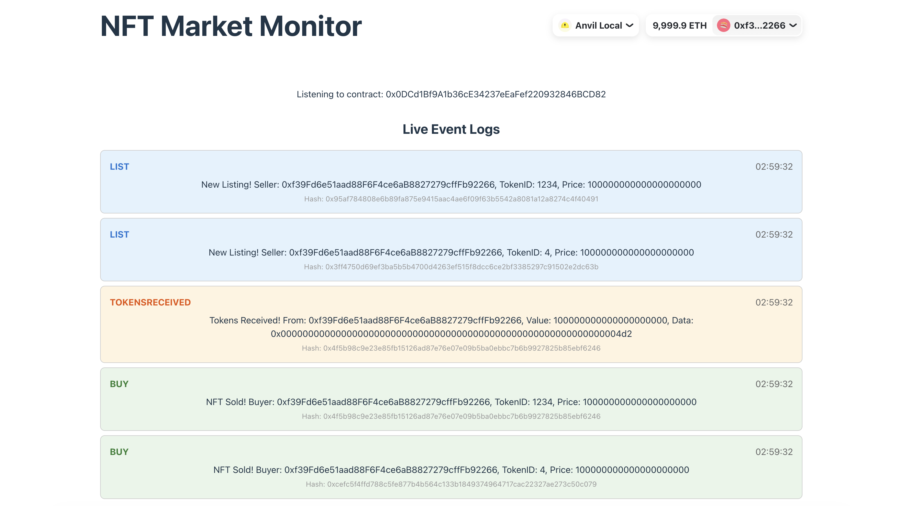

# NFTMarket Monitor



## Usage

1) Run Anvil
```bash
anvil
```

2) Deploy contracts (from the contract directory)

(keysore config require)

```bash
make deploy local
```

3) Update the frontend `.env` file with the NFTMarket contract address

4) Run the frontend (from the frontend directory)
```bash
pnpm dev
```

5) Run tests (from the contract directory)

parse your test address to Makefile --sender <YOUR_ADDRESS>

```bash
make test
```
